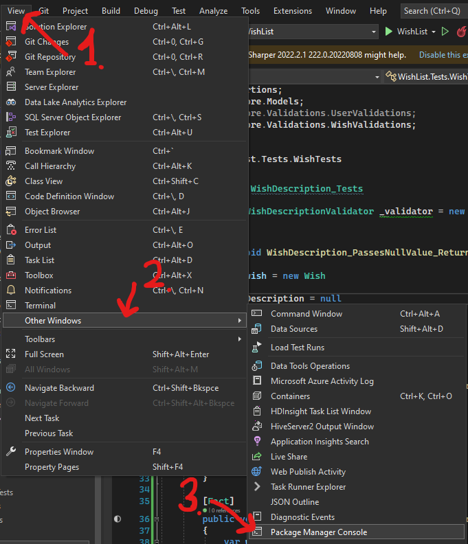
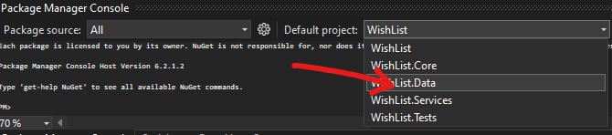

# Wish List API
# Description

This is a technical task for a company SIA "ABC solutions". Project contains an API with CRUD.

# Install

* Install SQL Server (https://go.microsoft.com/fwlink/p/?linkid=866662);
* Fork this repository and clone it on your computer or download it as a .zip file and unarchive it;
* Open project in your file explorer and open WishList and click on `WishList.sln`;
* In Visual Studio 2022 on the top left of the taskbar select View > Other Windows > Package Manager Console;



* Near the console area select default project as WishList.Data;



* Inside console write `update-database`;
* Start the project without debugging;
* Done :)

# Usage

### Wish

This API contains these endpoints:

* Get Wishes : `GET /api/wish`
* Get Wish by ID : `GET /api/wish/{id}`

|Parameter|Type|Rule|
|---|---|---|
|`id`|integer|Required - Wish ID|

* Create a Wish : `POST /api/wish`

### JSON Request example

```c#
{
  "description": "string"
}
```

|Parameter|Type|Rule|
|---|---|---|
|`description`|string|Required - Wish description|

* Update a Wish : `PATCH /api/wish`

### JSON Request example

```c#
{
  "description": "string"
}
```

|Parameter|Type|Rule|
|---|---|---|
|`description`|string|Required - Wish description|

* Delete a Wish : `DELETE /api/wish/{id}`

|Parameter|Type|Rule|
|---|---|---|
|`id`|integer|Required - Wish ID|

### User

* Get names from users : `POST /api/users`

### JSON Request example

```c#
[
  {
    "type": "string",
    "id": 0,
    "name": "string",
    "email": "string"
  }
]
```

|Parameter|Type|Rule|
|---|---|---|
|`type`|string|Required - User type|
|`id`|string|Required - User ID|
|`name`|string|Required - User name|
|`email`|string|Required - User email|

# Technologies Used

* ASP.NET Core Web API;
* Entity Framework (core, sqlite, tools, design);
* AutoMapper;
* xUnit (FluentAssert).